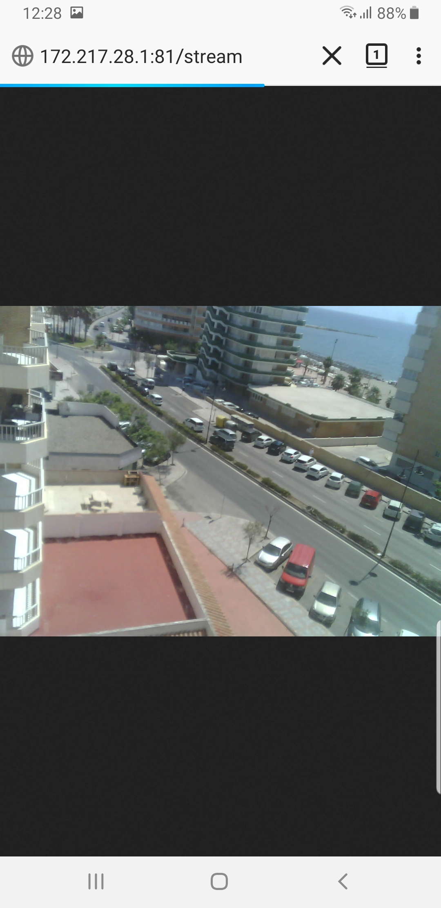

# Esp32AutoCamera
ESP32-CAM with an open wifi access point and a captive portal,  for fast deployment of a wireless camara.

  This is a mash-up of some of the example programs for the ESP32 device.   The goal is to have a inmediate way to access a camera stream without any configuration or security.
  The ESP32-CAM is configured as an access point,  it has a DNS server to act as a captive portal,  so your when  device (phone, laptop, etc) connects,  it should open a "login" page that redirects you to the actual stream.

  Working fine with Windows,  Android, MacOS and iPhone.
  In Windows,  your browser may have redirects disabled,  so you may need to confirm  the redirection.
  In Android,  in some devices,  the login page is opened with the internal viewer that breaks the redirect,  so you have to press the three dots and tell it to "Open in Browser".
  
  You can configure the Access Point name chaniging this line:   WiFi.softAP("ESP32-CAM Portal");
  The framesize is configured with this line:   s->set_framesize(s, FRAMESIZE_UXGA);
  The frame options are:
  
  <option value="10">UXGA(1600x1200)</option>

  <option value="9">SXGA(1280x1024)</option>

  <option value="8">XGA(1024x768)</option>

  <option value="7">SVGA(800x600)</option>

  <option value="6">VGA(640x480)</option>

  <option value="5">CIF(400x296)</option>

  <option value="4">QVGA(320x240)</option>

  <option value="3">HQVGA(240x176)</option>

  <option value="0">QQVGA(160x120)</option>

 It's all ugly,  but it works for me.    Comments and advice for improvements are welcome.  Enjoy!

To compile for the ESP-EYE, uncomment out CAMERA_MODEL_ESP_EYE (and comment out the other models), select "ESP32 Wrover Module" for the board and partition scheme "Huge APP (3MB No OTA)"
